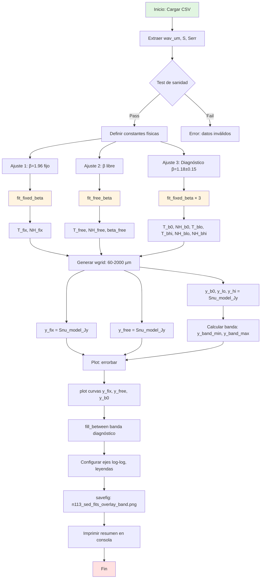

# README.md

## Ajuste de SED de Polvo para N113 (LMC): Implementación y Algoritmo

**Script principal:** `SED.py`  
**Paper de referencia:** Gong et al. 2024, A&A (arXiv:2405.04719)

---

## Descripción General

Este código ajusta la distribución espectral de energía (SED) de polvo frío en la región N113 de la Nube Mayor de Magallanes usando fotometría Herschel PACS+SPIRE (100–500 µm) con un modelo de modified blackbody (MBB).

**Características:**

- Tres ajustes simultáneos: β fijo (1.96), β libre, y diagnóstico (β = 1.18 ± 0.15)
- Gráfico estilo paper con banda sombreada para el diagnóstico
- Fully reproducible: solo numpy, scipy, matplotlib

---

## Uso Rápido

```bash
python sed_fit_plot_n113_band.py n113_sed_points_unbinned.csv
```

**Output:**

- `n113_sed_fits_overlay_band.png` (figura log-log con 3 ajustes)
- Parámetros impresos en consola: $T_d$, $N_H$, β, χ²

---

## Formato del Input (CSV)

El archivo `n113_sed_points_unbinned.csv` debe tener columnas:

```csv
band,wav_um,file,I_MJy_sr,S_Jy,Serr_Jy
PACS100,100.0,<filename>,3650.71,155.52,15.55
...
```

- `wav_um`: longitud de onda en micrones
- `S_Jy`: flujo en Janskys (beam de 40″)
- `Serr_Jy`: incertidumbre en flujo (típicamente 10% de S_Jy)

---

## Modelo Físico

### Ecuación Fundamental

$
S_\nu = \Omega \, B_\nu(T_d) \, \left(1 - e^{-\tau_\nu}\right)
$

donde:

- $B_\nu(T_d)$: función de Planck a temperatura de polvo $T_d$
- $\tau_\nu = N_{\rm H} \, m_{\rm H} \, \kappa_\nu / r_{\rm GDR}$: profundidad óptica
- $\kappa_\nu = \kappa_0 \, (\nu/\nu_0)^\beta$: opacidad del polvo (ley de potencia)
- $\Omega = 4.26 \times 10^{-8}$ sr: ángulo sólido del beam (HPBW = 40″)

### Parámetros Fijos (Gong+2024)

| Parámetro       | Valor         | Unidad   |
|-----------------|---------------|----------|
| $\Omega$      | 4.26×10⁻⁸     | sr       |
| $r_{\rm GDR}$ | 300           | —        |
| $\kappa_0$    | 0.8           | cm²/g    |
| $\nu_0$       | 230           | GHz      |

### Parámetros Libres

- **Caso 1 (β fijo):** $T_d$, $N_{\rm H}$  
- **Caso 2 (β libre):** $T_d$, $N_{\rm H}$, $\beta$  
- **Caso 3 (diagnóstico):** $T_d$, $N_{\rm H}$ para β ∈ {1.03, 1.18, 1.33}

---

## Diagrama de Flujo del Algoritmo



---

## Funciones Clave

### `Bnu_cgs(nu_hz, T)`

**Propósito:** Calcula la función de Planck en unidades CGS.

**Input:**

- `nu_hz` (float o array): frecuencia en Hz
- `T` (float): temperatura en K

**Output:**

- $B_\nu(T)$ en erg s⁻¹ cm⁻² Hz⁻¹ sr⁻¹

**Algoritmo:**

```python
x = h * nu_hz / (kB * T)
return (2.0 * h * nu_hz**3 / c**2) / np.expm1(x)
```

(usa `expm1` para estabilidad numérica en $e^x - 1$)

---

### `Snu_model_Jy(wav_um, T, NH, beta)`

**Propósito:** Modelo MBB completo, devuelve flujo en Jy.

**Input:**

- `wav_um` (array): longitudes de onda en µm
- `T` (float): temperatura de polvo en K
- `NH` (float): columna de H en cm⁻²
- `beta` (float): índice espectral de opacidad

**Output:**

- `S_nu` (array): flujo en Jy (beam de 40″)

**Algoritmo:**

```python
wav_cm = wav_um * 1e-4
nu_hz = c / wav_cm
kappa = kappa0 * (nu_hz / nu0)**beta
tau = NH * mH * kappa / rGDR
I_nu_cgs = Bnu_cgs(nu_hz, T) * (1.0 - np.exp(-tau))
I_nu_Jy_sr = I_nu_cgs / 1e-23
return Omega * I_nu_Jy_sr
```

**Conversión dimensional:**

1. λ (µm) → ν (Hz)
2. κ(ν) usando ley de potencia
3. τ_ν a partir de N_H y κ
4. I_ν (cgs) → I_ν (Jy/sr) → S_ν (Jy en beam)

---

### `fit_fixed_beta(wav_um, S_Jy, Serr_Jy, beta, p0)`

**Propósito:** Ajuste de mínimos cuadrados con β fijo.

**Input:**

- `wav_um`, `S_Jy`, `Serr_Jy`: datos observacionales
- `beta` (float): valor fijo de β
- `p0` (tuple): guess inicial para (T, NH)

**Output:**

- `popt` (tuple): (T_fit, NH_fit)
- `pcov` (array): matriz de covarianza

**Algoritmo:**

```python
popt, pcov = curve_fit(
    model_beta_fixed(beta),  # wrapper que fija beta
    wav_um, S_Jy,
    sigma=Serr_Jy,
    p0=p0,
    bounds=([5.0, 1e20], [150.0, 5e24]),
    absolute_sigma=True,
    maxfev=200000
)
return popt, pcov
```

**Método:** Levenberg-Marquardt (χ² con pesos)

---

### `fit_free_beta(wav_um, S_Jy, Serr_Jy, p0)`

**Propósito:** Ajuste de mínimos cuadrados con β libre.

**Input:**

- `wav_um`, `S_Jy`, `Serr_Jy`: datos
- `p0` (tuple): guess inicial para (T, NH, beta)

**Output:**

- `popt` (tuple): (T_fit, NH_fit, beta_fit)
- `pcov` (array): matriz de covarianza

**Algoritmo:**

Similar a `fit_fixed_beta`, pero con 3 parámetros libres y bounds para β ∈ [−1, 4].

---

### `main(csv_path)`

**Propósito:** Orquestador principal del pipeline.

**Pasos:**

1. Cargar CSV → extraer `wav_um`, `S`, `Serr`
2. Validar datos (finitos, positivos)
3. Ejecutar los 3 ajustes:
   - β = 1.96 fijo
   - β libre
   - β = 1.18 ± 0.15 (3 curvas)
4. Generar grid de longitudes de onda (`wgrid`)
5. Evaluar modelos en `wgrid` → curvas `y_fix`, `y_free`, `y_b0`, `y_lo`, `y_hi`
6. Calcular envolvente de banda: `y_band_min`, `y_band_max`
7. Plot:
   - `errorbar()` para datos
   - `plot()` para curvas
   - `fill_between()` para banda
8. Guardar PNG y loggear parámetros

---

## Variables Principales en el Código

| Variable       | Tipo     | Descripción                                      |
|----------------|----------|--------------------------------------------------|
| `wav_um`       | ndarray  | Longitudes de onda observadas (µm)               |
| `S`            | ndarray  | Flujos observados (Jy)                           |
| `Serr`         | ndarray  | Incertidumbres en flujo (Jy)                     |
| `T_fix`        | float    | Temperatura ajustada (β=1.96)                    |
| `NH_fix`       | float    | Columna de H ajustada (β=1.96)                   |
| `T_free`       | float    | Temperatura ajustada (β libre)                   |
| `NH_free`      | float    | Columna de H ajustada (β libre)                  |
| `beta_free`    | float    | β ajustado (β libre)                             |
| `T_b0`         | float    | Temperatura ajustada (β=1.18)                    |
| `NH_b0`        | float    | Columna de H ajustada (β=1.18)                   |
| `T_blo`, `T_bhi` | float  | Temp. ajustadas (β=1.03, β=1.33)                 |
| `wgrid`        | ndarray  | Grid de λ para curvas (60–2000 µm, 600 puntos)   |
| `y_fix`        | ndarray  | Curva modelo (β=1.96)                            |
| `y_free`       | ndarray  | Curva modelo (β libre)                           |
| `y_b0`         | ndarray  | Curva modelo (β=1.18)                            |
| `y_lo`, `y_hi` | ndarray  | Curvas límites (β=1.03, 1.33)                    |
| `y_band_min/max` | ndarray | Envolvente para fill_between                   |

---

## Dependencias

```python
import sys
import numpy as np
import pandas as pd
from scipy.optimize import curve_fit
import matplotlib.pyplot as plt
```

**Versiones testeadas:** numpy≥1.20, scipy≥1.7, matplotlib≥3.3, pandas≥1.3

---

## Tests de Validación Incluidos

1. **Sanidad de datos:**
   ```python
   assert np.all(np.isfinite(wav_um)) and np.all(wav_um > 0)
   assert np.all(np.isfinite(S)) and np.all(S > 0)
   ```

2. **Positividad de curvas:**
   ```python
   assert np.all(y_fix > 0) and np.all(y_free > 0)
   ```

3. **Convergencia del optimizador:** Verificado implícitamente por `curve_fit` (lanza error si falla).

---

## Outputs Esperados

**Consola:**

```
=== Fit summary ===
beta fixed 1.96: Td=25.031 K, NH=4.171759e+22 cm^-2
beta free: Td=29.318 K, NH=5.275866e+22 cm^-2, beta=1.5532
diag beta 1.18: Td=35.158 K, NH=6.215851e+22 cm^-2
diag beta 1.03: Td=38.366 K, NH=6.516813e+22 cm^-2
diag beta 1.33: Td=32.510 K, NH=5.860736e+22 cm^-2
Saved: n113_sed_fits_overlay_band.png
```

**Gráfico:**

- Eje X: Wavelength (µm), escala log, rango [70, 1800]
- Eje Y: S_ν (Jy), escala log, rango [0.1, 300]
- Puntos negros con errorbars (5 puntos PACS+SPIRE)
- Curva azul: β libre ($T_d \approx 29$ K, β ≈ 1.55)
- Curva naranja: β=1.96 fijo ($T_d \approx 25$ K)
- Curva verde + banda sombreada: diagnóstico β=1.18±0.15

---

## Modificaciones Comunes

### Cambiar el rango de β en el diagnóstico

```python
# En main(), línea ~90:
dbeta = 0.20  # en vez de 0.15
```

### Usar χ² log-space

Reemplazar `fit_fixed_beta` con:

```python
def residuals_log(p, wav, S, Serr, beta):
    T, NH = p
    Smod = Snu_model_Jy(wav, T, NH, beta)
    return (np.log(Smod) - np.log(S)) / (Serr / S)

popt = least_squares(residuals_log, x0=[25, 6e22], ...)
```

### Aplicar correcciones de color

Después de cargar `S`, multiplicar por `K_color`:

```python
# Ejemplo para PACS (ver PACS handbook):
K_color = color_correction_pacs(wav_um, T_guess, beta_guess)
S_corrected = S * K_color
```

---

## Referencias

- **Paper:** Gong et al. 2024, A&A (arXiv:2405.04719)
- **Datos:** Gordon et al. 2014, ApJ, 797, 85 (HERITAGE Survey)
- **Kernels:** Aniano et al. 2011, PASP, 123, 1218
- **Modelo MBB:** Draine 2011, "Physics of the ISM and IGM" (Princeton)

---

## Contacto y Licencia

**Autor:** [Tu nombre]  
**Licencia:** MIT (o la que prefieras)  
**GitHub:** [link al repo si existe]

Para reportar issues o sugerir mejoras, abrir un issue en el repositorio.
